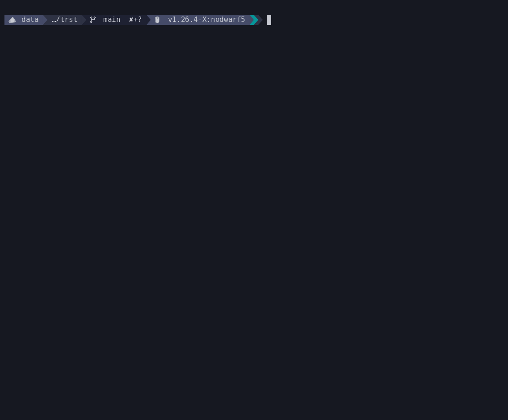

# trst



> Song featured: Heroes Tonight by Janji and Johnning (NCS).
> 
> For legal reasons this is a joke.

CLI for local LLMs to roast your music taste.

## Why the name?

Short for `track-roast`.

Another way you can think of it is: "trust me bro my music taste is totally good".

## Who is this not for?

Those who cannot tolerate humour ranging from light-hearted banter to absolute emotional damage.

> If you do not want the LLM to be too mean, there is a scale of "how much of a jerk the LLM can be".
> This is mentioned below

## Features

- Read `.lrc` when found in the same directory as audio file(s).
- Semantically infer genre/sub-genre (best effort basis) via LLM
- Local metadata cache for parsed songs
> No CGO Sqlite database, defaults to where it makes sense on your platform

- Read file codec, title, description, metadata

- *Choose between distinct personas*, including:
    - **brainrot**: A chaotic, hyperactive stream of raw Unicode emojis and stunted streamer slang. Decries your "L codec choices" with zero aura.
    - **detective**: A Sherlock Holmes-inspired sleuth treating your lossy files and neglected metadata as an active crime scene.
    - **elitist**: A snobby 90s record-store clerk who despises the mainstream and sneers at digital peasant compression profiles.
    - **hater**: A relentlessly toxic internet troll providing pure, bad-faith hostility regardless of configurations.
    - **influencer**: A cringe-inducing content creator plagued by toxic enthusiasm, over-inflated vocal fry, and desperate engagement metrics.
    - **nerd**: A pedantic, socially awkward tech nerd starting sentences with _"Erm, actually..."_ to viciously analyse your compressed frequency cutoff maps.
    - **normie**: A delusional TikTok-era middle-schooler defending generic radio pop charts using shallow arguments.
    - **parent**: A traditional immigrant Asian parent comparing your lazy file selection directly to your flawless cousin Timmy (who gets straight A+). Wields the slipper (if yk yk).
    - **pianist**: An arrogant classical conservatory elite appalled by lossy shortcuts that clip essential musical harmonics.
    - **posh**: A passive-aggressive British aristocrat deploying devastatingly polite backhanded insults over high tea regarding your low-budget container formats.
    - **sarcastic**: A hyper-sassy, cynical lady dispensing raw, zero-filter side-eye directly at your audio storage compression standards.
    - **spitter**: A ferocious battle rapper delivering fast-paced cadences in snappy 8-12 word bars, targeting your low-bitrate MP3 choices.
    - **therapist**: A concerned professional diagnosing your fragile psychological state based on your severe lack of metadata care.

- Set how much of a jerk the LLM persona can be. On a scale from 1 to 5, defaults to 3. 
1 is lowest, 5 is highest.
> Note: Hater will still be a hater even you set jerk value to 1.

- Set whether profanities are allowed in the outputs. Defaults to false.
> Most models have safety nets baked into their system prompts, if you do want this
you are very much on your own.


## Installation

### Via Go

```bash
go install github.com/bladeacer/trst/cmd/trst@latest
```

### Via binary release

Download the latest binary for your platform from the
[releases page](https://github.com/bladeacer/trst/releases), extract it, and
place it in your `$PATH`.

Pre-built binaries are available for:

| OS | Architectures |
| --- | --- |
| Linux / WSL | `amd64` (x86-64), `arm64` (ARM 64-bit) |
| macOS | `amd64` (Intel), `arm64` (Apple Silicon) |
| Windows | `amd64` (x86-64), `arm64` (ARM 64-bit) |

All binaries are fully static (compiled with `CGO_ENABLED=0`) with no
C runtime dependencies - the Linux archive works on both native Linux
and WSL without extra setup.

### Versioning Notice

This is pre 1.0 software and a work in progress (WIP), expect some breaking changes between updates.

## Usage

Install and start `ollama` first.
> See [ollama's website](https://ollama.com/) for more details.

```bash
ollama pull llama3.2 # or use any other model of your choice
trst
```

## Dependencies

- `ollama`: Powers the local LLM inference engine for generating roasts. ^_^
- `ffmpeg/ffprobe`: Handles deep container queries to extract core audio file metadata.
- `yt-dlp` (Optional): Pulls live details and metadata directly from YouTube/YouTube Music URLs.
- `playerctl` (Optional): Queries MPRIS D-Bus interfaces to roast currently playing media.

## Planned Features

- Provide song from remote URL via `yt-dlp`
- Roasts on folder/album or playlist (local/remote)
- Better analysis into audio files (time signature, frequency range)
- Continually roasts currently playing media via `playerctl`
- OpenRouter support

## LLM Usage Disclosure

I used AI assistance for writing the code.

## License

This Golang CLI app, "trst" is released under the GNU Affero General Public
License version 3 (AGPLv3) License.

### License Notice

This file is part of trst. trst is a CLI for local LLMs to roast your music taste.
Copyright (c) 2026 bladeacer

trst is free software: you can redistribute it and/or modify it under the
terms of the GNU Affero General Public License as published by the Free Software
Foundation, either version 3 of the License, or (at your option) any later version.

trst is distributed in the hope that it will be useful, but WITHOUT ANY WARRANTY;
without even the implied warranty of MERCHANTABILITY or FITNESS FOR A PARTICULAR
PURPOSE. See the GNU Affero General Public License for more details.

You should have received a copy of the GNU Affero General Public License along with trst.
If not, see <https://www.gnu.org/licenses/>.

### License file

You can find the [license file here](./LICENSE).

## Credits

This CLI was made possible by the following open-source libraries

- [`modernc.org/sqlite`](https://gitlab.com/cznic/sqlite): A pure Go, zero-dependency SQLite driver that requires no CGO implementation.
- [`dhowden/tag`](https://github.com/dhowden/tag): A clean audio metadata parsing engine used for reading track container properties.
- [`nbedos/termtosvg`](https://github.com/nbedos/termtosvg): Record terminal to svg, public archived but still works like a charm.
- [`asciinema/agg`](https://github.com/asciinema/agg): asciinema gif generator.
